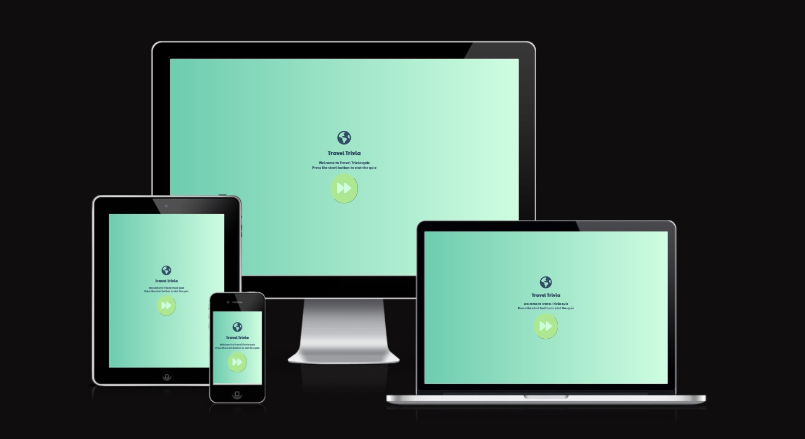
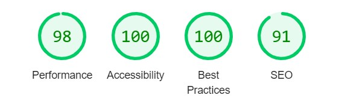

# Travel Trivia Quiz - A Milestone Project

My second milestone project, undertaken as part of the Code Institutes Diploma in Software Development. This is a frindly quiz game 
that features travel related questions. Here is the link for [Travel Trivia](https://sabrinastoekly.github.io/quiz_website/)

# Features

The website has a simple design, with a friendly landing page, from there you can start the quiz.
The desire outcome of the site is a clean layout,where every feature is easy located.

## Intro Area 

 

From the moment you visit the website you have a welcome message and the instruction on how to start the quiz. 

### Quiz Area

With a linear design, that leads throughout the quiz from one question to another and a simplistic formation the quiz area features 10  multiple-choice questions.

### Score Area 

The score area display's a phrase depending on your result, along with the score of the user and a "Go Again" button that leads you to the start of the game.

# The Skeleton Plane 

[Wireframe Intro Area](assets/readme_imgs/Wireframe_intro.jpg)

[Wireframe Questions Area](assets/readme_imgs/Wireframe_questions.jpg)

[Wireframe Score Area](assets/readme_imgs/Wireframe_score.jpg)

##  Color Palette 

I used the site colorhunt.co to bring together a colour pallet for the base of the website. The choice of the monocrhomatic pallet with light colour a age friendly website.

## Fonts 

I've chosen "Paytone One" as the font for my website as it is a very appealing font and easy to read. My sorcce for the font was Google fonts.

# Testing
 
  - I've tested to play the quiz in different browers and different devices.
  - Ive had a few problem with a the "Go Again" button and I could not understand how to make the  button work. I spoke to Spence Barriball, my mentor, and he was able to guide me and point me to the correct direction.
  - When I first ran my JavaScript code on the JShint I got sever l warning "	'const'('let') is available in ES6 (use 'esversion: 6') or Mozilla JS extensions (use moz)." That was easily solver with a comment placed at the very start of the code (/*jshint esversion: 6 */.)

 

  ## Validator 

  HTML

  CSS
 
 JSHint
  - I ran the quiz through JSHint checker and no errors (One Warning) come up;

# Deployment 

For the website development I used Gitpod as served as the local repository and IDE and GitHUb served as the remote repository.

The following steps were followed to maintain version control;

- I created a repository on GitHub and named it 'quiz_website' 
- I then signed in to Gitpod and opened a new workspace via the repository name 'quiz_website'
- I created the pages, folders and files on GitPod
- I saved my work on GitPod at regular intervals and pushed it to GitHub to keep it safe

This is the process I followed having completing each significant section of code, I typed the following into the terminal:
- git add . (This added the work to git)
- git commit -m "COMMIT MESSAGE" (this to update my local repo)
- git push (This pushed the work to GitHub)

I followed the below steps on GitHub to deploy the website. 

- Go to repository and select 'settings'. 
- Under the 'Github pages@ section, click on the live link. 
- On "Source", select "Branch: main' for Branch and click save.
- The website is now published on GitHub Pages and the link is provided on the same section

# Technologies used
- [HTML5](https://en.wikipedia.org/wiki/HTML) for markup 
- [CSS3](https://en.wikipedia.org/wiki/CSS) for style 
- [Google Fonts](https://fonts.google.com/) for fonts 
- [Github]( https://github.com/) to keep the file 
- [Gitpod]( https://www.gitpod.io/) for version control
- [Colorhunt.co](https://colorhunt.co/) to build a colour palette for the site 
- [Font Awesome](https://fontawesome.com/v5.15/icons) for icons

# Resources
- [Code Institute](https://codeinstitute.net/) Course material
- [W3Schools]( https://www.w3schools.com/) 
- [Am I Responsive](http://ami.responsivedesign.is/) – Check the sites responsiveness
- [W3C](https://validator.w3.org/) Validate HTML code
- [W3C]( https://jigsaw.w3.org/css-validator/) CSS Validation
- [JSHint](https://jshint.com/) JavaScript Validation  
- [W3Schools](https://www.w3schools.com/) - helped me in researching and fixing errors along the way

