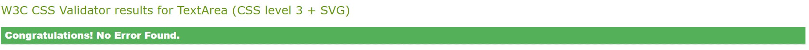

# Travel Trivia Quiz - A Milestone Project

My second milestone project, undertaken as part of the Code Institutes Diploma in Software Development. 

# Who Is This Website For?

# Features

The website has The design of each page has been kept simplistic. 
The overall goal of the site is to only contain information which makes a positive impression without overwhelming the overall design. 

## Intro Area 

 

From the moment you visit the website  

### Quiz Area

### Score Area 

# The Skeleton Plane 
The design of this project was to make the content simplistic to view on any screen size but being mobile friendly was also key. 
Below is a link to the wireframe I had completed 

[Wireframe Intro Area](assets/readme_imgs/Wireframe_intro.jpg)

[Wireframe Questions Area](assets/readme_imgs/Wireframe_questions.jpg)

[Wireframe Score Area](assets/readme_imgs/Wireframe_score.jpg)

##  Color Palette 

I used the site colorhunt.co to bring together a colour pallet for the base of the website. The choice of the dark background was made so the photos on the website would be more visible and attacking, however not too dark therefore bringing a more positive image for the website as long with the two yellow tones to bring some love into the site.

## Fonts 

I used google fonts to discover and use fonts that would suit my website. I’ve chosen, Unbounded, cursive for the title of the website so I could bring a more professional looking and Oswald, sans-serif to complete the look of the INSTANT website

# Testing
 
 - 

 

 ## Bugs

  ## Validator 

  HTML

  CSS
 

# Version Control 

- GitHub
- Gitpod

Gitpod served as the local repository and IDE. 
GitHUb served as the remote repository. 

The following steps were followed to maintain version control;

- I created a repository on GitHub and named it 'photography_website' 
- I then signed in to Gitpod and opened a new workspace via the repository name 'photography_website'
- I created the pages, folders and files on GitPod
- I saved my work on GitPod at regular intervals and pushed it to GitHub to keep it safe

This is the process I followed having completing each significant section of code, I typed the following into the terminal:
- git add . (This added the work to git)
- git commit -m "COMMIT MESSAGE" (This committed the work)
- git push (This pushed the work to GitHub)

# Deployment 

I followed the below steps on GitHub (insert link) to deploy the website. 

- Go to repository and select 'settings'. 
- Under the 'Github pages@ section, click on the live link. 
- On "Source", select "Branch: main' for Branch and click save.
- The website is now published on GitHub Pages and the link is provided on the same section

# Technologies used
- [HTML5](https://en.wikipedia.org/wiki/HTML) for markup 
- [CSS3](https://en.wikipedia.org/wiki/CSS) for style 
- [Google Fonts](https://fonts.google.com/) for fonts 
- [Github]( https://github.com/) to keep the file 
- [Gitpod]( https://www.gitpod.io/) for version control
- [Colorhunt.co](https://colorhunt.co/) to build a colour palette for the site 
- [Font Awesome](https://fontawesome.com/v5.15/icons) for icons

# Resources
- [Code Institute](https://codeinstitute.net/) Course material
- [W3Schools]( https://www.w3schools.com/) 
- [Am I Responsive](http://ami.responsivedesign.is/) – Check the sites responsiveness
- [W3C](https://validator.w3.org/) Validate HTML code
- [W3C]( https://jigsaw.w3.org/css-validator/) CSS Validation 
- [W3Schools](https://www.w3schools.com/) - helped me in researching and fixing errors along the way

